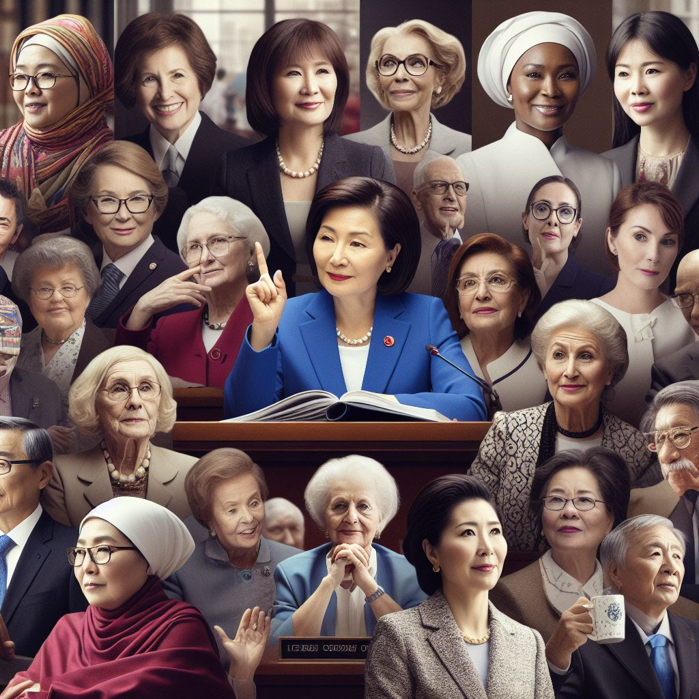

# History of Women Participation in World Politics

<a target="_blank" href="https://womeninpolitics.streamlit.app/"></img></a>
Streamlit app: https://womeninpolitics.streamlit.app/

## Intoduction
This is a Steamlit app to Visualize the participation and involvement on Women in politics around the world. 

We have come a long way in past 100 years where in begining of 20th centrury women were not allowed to vote in most countries. Now, women have made significant progress in the political arena, with more and more women holding positions of power and influence in governments around the world. 

This app aims to showcase the current state of women in politics, including their representation in parliaments, and as heads of state. It also provides a comparison between different regions and countries, highlighting the progress made by women in each area. 

## Features
1. Interactive plots to visualize the when the voting rights were given to men and women takign the first step towards a democracy.

2. Interactive world map: This map allows users to explore the representation of women in politics in different countries. By hovering over a country, users can see the percentage of women in parliament, ministerial positions, and as heads of state.

3. Country-wise comparison: Users can select a specific country and see the representation of women in politics over the years. This feature provides a visual representation of the progress made by women in that country.

## Conclusion
This Streamlit app provides an easy and interactive way to explore the representation of women in politics around the world. It highlights the progress made by women in the political arena, while also shedding light on the challenges that still exist. By visualizing the data, we hope to inspire and encourage more women to participate in politics and continue the journey towards gender equality. 

## Data 
The data is taken from the data respository published by OurWorldInData.org. and  Varieties of Democracy project (V-Dem). 

Varieties of Democracy (V-Dem) is a unique approach to conceptualizing and measuring democracy. V-Dem distinguishes between five high-level principles of democracy: electoral, liberal, participatory, deliberative, and egalitarian, and collects data to measure these principles.

Our World in Data is a project that presents research and data to address global challenges, offering over 12,000 charts across various topics, all freely accessible and open source1. It aims to make information on significant global issues understandable and available to those working towards a better world2.

Bastian Herre (2024) - “Women have made major advances in politics — but the world is still far from equal” Published online at OurWorldInData.org. Retrieved from: 'https://ourworldindata.org/women-political-advances' [Online Resource]

## Future work

- I plan to incorporate more details on the women chief exeuctives leaders, a small bio, photo and the link to their wiki page.
- Adding more visualisation of women participation in ministarial posiotion
- More visualisation to show the effect of increaseing women participation in politics on the country's development.

